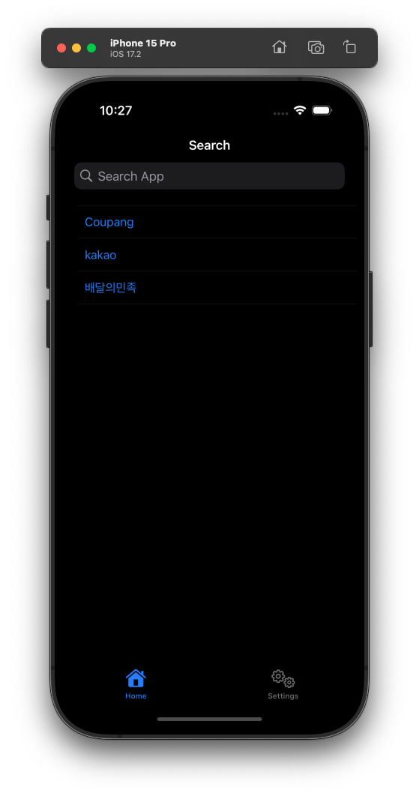
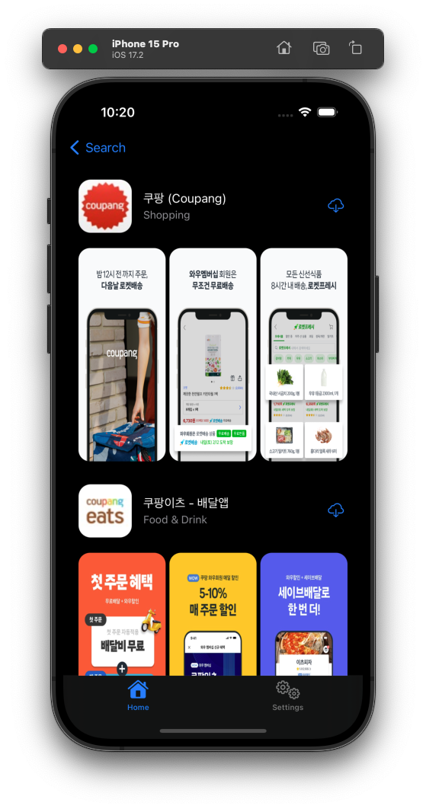
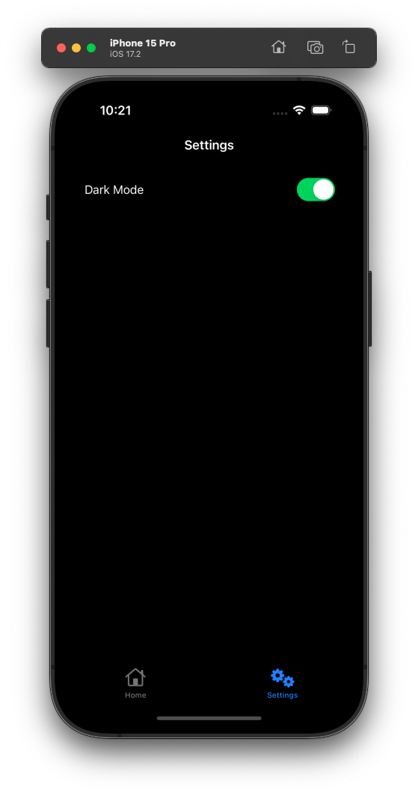

# AppStoreSearch

[iTunes Search API](https://developer.apple.com/library/archive/documentation/AudioVideo/Conceptual/iTuneSearchAPI/Searching.html#//apple_ref/doc/uid/TP40017632-CH5-SW1)를 이용해 앱스토어의 앱을 검색하는 기능을 구현한 애플리케이션입니다.

## 구현 기능
* Dark Mode 지원
* Core Data를 이용한 search history 저장
* [Pure DI](https://blog.ploeh.dk/2014/06/10/pure-di/)를 이용한 Dependency Injection
* UITest, Unit Test 일부 구현
* [RxSwift](https://github.com/ReactiveX/RxSwift)를 이용한 Input - Output 구조의 MVVM 구현
* Code Based Auto Layout with [SnapKit](https://github.com/SnapKit/SnapKit)

## Commit Message Style
* feat: 기능 추가
* fix: 버그 수정
* docs: 문서 수정
* style: 코드 스타일 변경
* test: 테스트 코드 추가, 수정
* refactor: 코드 리팩토링
* rename: 파일 이름 수정
* remove: 파일 삭제

## Swift Style Guide
* [Airbnb's swift style guide](https://github.com/airbnb/swift)

## Screenshots

